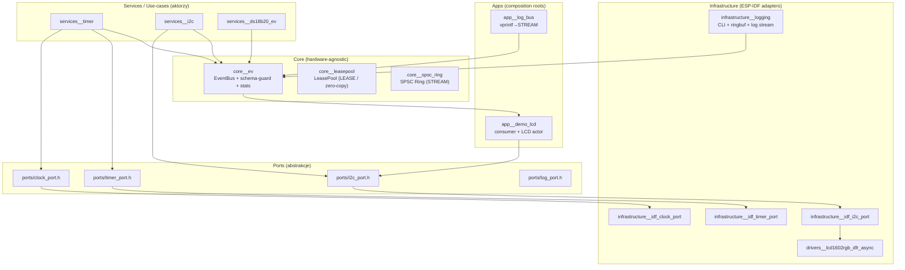
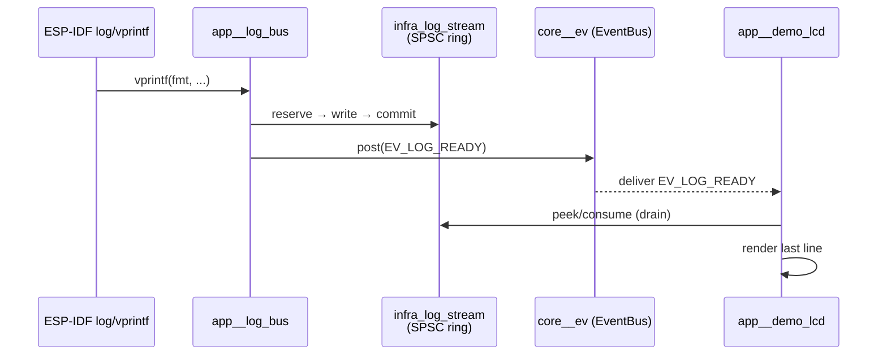

# ESP32 Event‑Driven Clean Architecture (Industrial Grade)


**esp32_event_clean_arch** to profesjonalny szkielet dla ESP32, który konsekwentnie wdraża **Clean Architecture (Ports & Adapters)** i **Event‑Driven Design** w języku C (ESP‑IDF). Projekt jest zoptymalizowany pod kątem niezawodności, deterministyki pamięci i obserwowalności w czasie rzeczywistym.

---

## Spis treści

- [Co dostajesz](#co-dostajesz)
- [Architektura](#architektura)
  - [Warstwy i zależności](#warstwy-i-zależności)
  - [Przepływ zdarzeń (STREAM/READY) – przykład log → LCD](#przepływ-zdarzeń-streamready--przykład-log--lcd)
- [Kontrakt zdarzeń (EV_SCHEMA)](#kontrakt-zdarzeń-ev_schema)
- [Szybki start – użytkownik](#szybki-start--użytkownik)
  - [Wymagania](#wymagania)
  - [Build + sanity check](#build--sanity-check)
  - [Flash + monitor (jedna komenda)](#flash--monitor-jedna-komenda)
  - [WSL 2: mapowanie USB / portu](#wsl-2-mapowanie-usb--portu)
- [CLI (REPL) – diagnostyka „na żywo”](#cli-repl--diagnostyka-na-żywo)
  - [Tabela komend i przykłady](#tabela-komend-i-przykłady)
- [Dema](#dema)
- [Dla dewelopera](#dla-dewelopera)
  - [Dodawanie nowego zdarzenia](#dodawanie-nowego-zdarzenia)
  - [Nowy serwis: dependency injection EventBus](#nowy-serwis-dependency-injection-eventbus)
  - [Nowy port i adapter (Ports & Adapters)](#nowy-port-i-adapter-ports--adapters)
  - [Dokumentacja API](#dokumentacja-api)
- [Licencja](#licencja)

---

## Co dostajesz

**Filozofia projektu**: maksymalnie czysta domena + deterministyczna komunikacja + brak „niespodzianek” w pamięci.

Najważniejsze cechy:

- **Clean Architecture w C/Embedded**
  - domena/serwisy nie zależą od ESP‑IDF,
  - zależności są wstrzykiwane (np. `const ev_bus_t* bus`, porty sprzętowe).
- **SSOT (Single Source of Truth) dla zdarzeń**
  - `core__ev/include/core_ev_schema.h` jako jedyne źródło: `SRC`, `CODE`, `KIND`, `QoS`, `FLAGS`, `DOC`.
- **Bezpieczne „fail‑fast”**
  - schema‑guard + selftest na starcie: wykrywanie rozjechanych definicji i błędnego użycia API.
- **Deterministyczna pamięć i zero‑copy**
  - `core__leasepool` dla payloadów typu **LEASE** (bez kopiowania i bez malloc w hot‑path),
  - `core__spsc_ring` dla payloadów typu **STREAM** (producer/consumer bez alokacji per event).
- **Observability (wbudowana diagnostyka)**
  - CLI w runtime: `evstat`, `lpstat`, `logrb`, `loglvl`.

---

## Architektura

### Warstwy i zależności

W tym repo komunikacja jest asynchroniczna (events), a zależności są odwrócone tak, aby domena była testowalna i niezależna od sprzętu.



**Zasada**: serwis nie „woła IDF”, tylko woła port (`ports/*`). EventBus jest wstrzykiwany jako `const ev_bus_t*`.

---

### Przepływ zdarzeń (STREAM/READY) – przykład log → LCD

W `demo_lcd_rgb` logi z ESP‑IDF są przechwytywane przez `app__log_bus` (wrapper `vprintf`) i streamowane do SPSC ring buffer. EventBus przenosi wyłącznie lekką notyfikację **READY** (`EV_LOG_READY`), a dane siedzą w ringu.



**Efekt**: „enterprise performance” – **zero‑alloc per log**, minimalny narzut, świetna responsywność UI.

---

## Kontrakt zdarzeń (EV_SCHEMA)

W `core__ev/include/core_ev_schema.h` każde zdarzenie ma:

- `src` i `code` (ID),
- `kind` (typ payloadu),
- `qos` (zachowanie kolejki przy przeciążeniu),
- `flags` (np. „CRITICAL”),
- `doc` (opis dla człowieka i narzędzi).

### KIND – typy zdarzeń

- **NONE** – tylko notyfikacja (bez payloadu),
- **COPY** – payload w `a0/a1`,
- **LEASE** – payload w LeasePool (handle + `nbytes`), zero‑copy i kontrolowana żywotność,
- **STREAM** – payload poza eventem (np. w SPSC ringu); event to notyfikacja `*_READY`.

### QoS – zachowanie pod obciążeniem

- **DROP_NEW** – gdy kolejka pełna: odrzuć nowe,
- **REPLACE_LAST** – nadpisuj ostatnie (idealne dla UI/kolorów/„ostatniego stanu”).

### Narzędzia (CLI)

- `evstat check` – weryfikuje spójność schematu (SSOT),
- `evstat list --doc --qos` – wypisuje zdarzenia, również **STREAM**,
- `evstat show <name|id|SRC:CODE>` – pokazuje metadane jednego zdarzenia.

---

## Szybki start – użytkownik

### Wymagania

- Docker (wystarczy, nie instalujesz ESP‑IDF lokalnie),
- kabel USB do płytki ESP32,
- (dla `demo_lcd_rgb`) LCD1602 RGB po I2C (DFRobot) – opcjonalnie, ale wtedy demo ma pełny sens.

### Build + sanity check

```bash
# 1) Zbuduj obraz narzędziowy (ESP‑IDF + toolchain + doxygen)
./scripts/build-docker.sh

# 2) Sprawdź środowisko, cache, pinning obrazu, defaults itd.
./scripts/doctor.sh
```

> Wersja IDF jest kontrolowana przez `.env` i „przypięta” do digestu, żeby build był powtarzalny.

### Flash + monitor (jedna komenda)

Domyślnie projekt to `demo_lcd_rgb`, target z `.env` (domyślnie `esp32c6`).

```bash
TARGET=esp32c6 CONSOLE=uart ./scripts/flash-monitor.sh
```

Przydatne zmienne środowiskowe:

- `PROJ=demo_hello_ev` / `demo_ds18b20_ev` / `demo_lcd_rgb`
- `TARGET=esp32c6|esp32c3|esp32s3|esp32h2`
- `CONSOLE=uart|usb`
- `ESPPORT=/dev/ttyUSB0` (wymuszenie portu)
- `ESPBAUD=921600` (flash) / `MONBAUD=115200` (monitor)
- `RESET_SDKCONFIG=1` (regeneracja sdkconfig z defaults)

Przykład zmiany demo:

```bash
PROJ=demo_hello_ev TARGET=esp32c6 CONSOLE=uart ./scripts/flash-monitor.sh
```

---

### WSL 2: mapowanie USB / portu

WSL 2 zwykle **nie widzi USB automatycznie**. Masz dwie praktyczne ścieżki:

#### A) usbipd (zalecane – prawdziwe USB w WSL)

W PowerShell (Administrator):

```powershell
usbipd list
usbipd attach --wsl --busid 1-5
```

W WSL sprawdź port:

```bash
ls -l /dev/ttyACM* /dev/ttyUSB*
```

Jeśli skrypt nie trafi – wymuś:

```bash
ESPPORT=/dev/ttyACM0 TARGET=esp32c6 CONSOLE=uart ./scripts/flash-monitor.sh
```

#### B) Mapowanie COM jako /dev/ttyS* (fallback)

WSL czasem widzi Windows‑owy COM jako `/dev/ttyS4`, `/dev/ttyS5`, itd. Skrypt `scripts/find-port.sh` ma fallback na `/dev/ttyS*`, ale jeśli masz kilka portów – **wymuś `ESPPORT`**.

---

## CLI (REPL) – diagnostyka „na żywo”

Po `flash-monitor.sh` uruchamia się monitor i konsola REPL:

- Wyjście: `Ctrl+]`
- Pomoc: `help`

### Tabela komend i przykłady

| Komenda | Co robi | Przykłady praktyczne |
|---|---|---|
| `evstat` | Statystyki EventBusa + introspekcja schematu | `evstat` · `evstat --reset` · `evstat stat --per-event` |
| `evstat list` | Lista zdarzeń z filtrami | `evstat list --doc` · `evstat list --qos` · `evstat list --kind STREAM` |
| `evstat show` | Szczegóły jednego zdarzenia | `evstat show EV_LOG_READY` · `evstat show 13` · `evstat show I2C:0x2000` |
| `evstat check` | Self‑check spójności schematu | `evstat check` |
| `lpstat` | Statystyki LeasePool (alloc/free, guardy) | `lpstat` · `lpstat --reset` · `lpstat dump` · `lpstat check` |
| `logrb` | Diagnostyka RAM ring‑buffera logów (offline debug) | `logrb stat` · `logrb tail 50` · `logrb dump --limit 200` · `logrb clear` |
| `loglvl` | Zmiana poziomu logowania tagów w runtime | `loglvl * I` · `loglvl DFR_LCD D` |

> Tip: `evstat list --qos` pokazuje też **STREAM** – to jest „twardy” dowód, że schemat i introspekcja są kompletne.

---

## Dema

### `demo_lcd_rgb` (domyślny)
- I2C scan + inicjalizacja LCD RGB (DFRobot),
- aktor LCD (zdarzenia `EV_LCD_*`),
- log‑stream: `EV_LOG_READY` + SPSC ring → LCD wyświetla ostatnią linię logu,
- CLI: `logrb`, `loglvl`, `evstat`, `lpstat`.

Uruchom:

```bash
PROJ=demo_lcd_rgb TARGET=esp32c6 CONSOLE=uart ./scripts/flash-monitor.sh
```

### `demo_ds18b20_ev`
- serwis DS18B20 generuje zdarzenia `EV_DS18_*` (COPY),
- przykład „serwis sprzętowy jako aktor”.

```bash
PROJ=demo_ds18b20_ev TARGET=esp32c6 CONSOLE=uart ./scripts/flash-monitor.sh
```

### `demo_hello_ev`
- minimalny „hello world” dla EventBusa i timera.

```bash
PROJ=demo_hello_ev TARGET=esp32c6 CONSOLE=uart ./scripts/flash-monitor.sh
```

---

## Dla dewelopera

### Dodawanie nowego zdarzenia

1. Dopisz event do X‑Macro `EV_SCHEMA` w:
   - `firmware/components/core__ev/include/core_ev_schema.h`
2. Zbuduj i uruchom:
   - `evstat check` (na urządzeniu)
3. Wykorzystuj `DOC` i konsekwentnie ustawiaj `KIND` / `QoS`:
   - UI / „ostatni stan” → `REPLACE_LAST`
   - payload duży → `LEASE` lub `STREAM`

### Nowy serwis: dependency injection EventBus

Kontrakt architektoniczny:

- serwisy nie wołają globalnie `ev_post(...)`,
- serwisy dostają `const ev_bus_t* bus` i używają `bus->vtbl->post(...)` / `post_lease(...)`.

**Zysk**: w testach możesz wstrzyknąć fake bus, a domena nie zależy od infrastruktury.

### Nowy port i adapter (Ports & Adapters)

Reguła:

- `ports/*` = czyste interfejsy (bez IDF),
- `infrastructure__idf_*` = adaptery ESP‑IDF (PRIV_REQUIRES: sterowniki),
- serwisy linkują do portów i korzystają z DI.

W CMake stosuj:
- `REQUIRES` dla publicznych zależności,
- `PRIV_REQUIRES` dla detali implementacyjnych (enkapsulacja).

### Dokumentacja API

```bash
./scripts/gen-docs.sh
# wynik: docs/html/index.html
```

Dodatkowo: `firmware/docs/architecture.md` opisuje architekturę i decyzje projektowe.

---

## Licencja

MIT © Wojciech Żurawski
