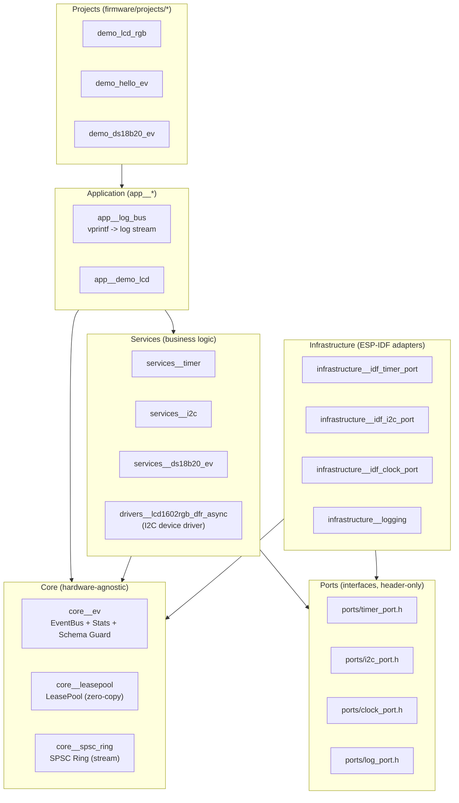
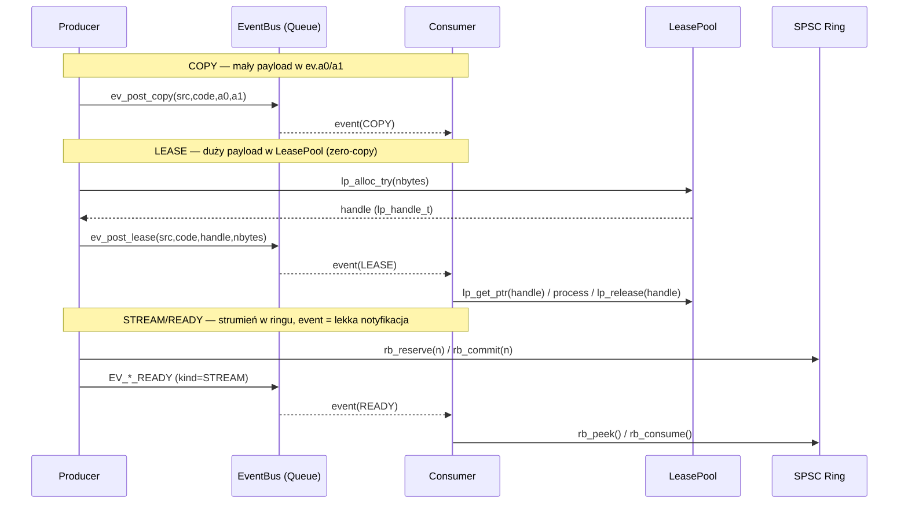
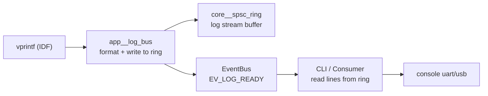
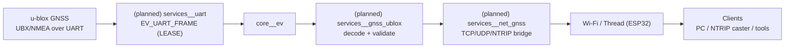

# ESP32 Event‑Driven Clean Architecture (Industrial Grade)


**esp32_event_clean_arch** to „industrial grade” szkielet dla ESP32, który wdraża **Clean Architecture (Ports & Adapters)** oraz **Event‑Driven Design** w języku C (ESP‑IDF).
Projekt jest zoptymalizowany pod kątem:

- izolacji domeny od sprzętu,
- deterministyki (pamięć, kolejki, QoS),
- obserwowalności „na żywo” (CLI/telemetria),
- powtarzalnych buildów (Docker pinowany digestem).

> Ten repozytorium jest też fundamentem pod **appliance GNSS**: dekodowanie ramek **u‑blox (UBX)** + udostępnienie danych przez Wi‑Fi/Thread jako interfejs sieciowy dla odbiorników bez karty sieciowej (roadmap w sekcji [GNSS u‑blox: kierunek rozwoju](#gnss-u-blox-kierunek-rozwoju)).

---

## Spis treści

- [Co dostajesz](#co-dostajesz)
- [Architektura](#architektura)
  - [Warstwy i zależności](#warstwy-i-zależności)
  - [Modele payload: COPY / LEASE / STREAM](#modele-payload-copy--lease--stream)
  - [STREAM/READY: przykład na logach](#streamready-przykład-na-logach)
- [Kontrakt zdarzeń (EV_SCHEMA)](#kontrakt-zdarzeń-ev_schema)
- [Szybki start](#szybki-start)
  - [Wymagania](#wymagania)
  - [Pierwsze uruchomienie](#pierwsze-uruchomienie-jedna-komenda)
  - [WSL 2: mapowanie USB (usbipd)](#wsl-2-mapowanie-usb-usbipd)
- [Cykl pracy: Build / Clean / Config](#cykl-pracy-build--clean--config)
  - [Build (kompilacja)](#build-kompilacja)
  - [Clean (czyszczenie) — krytycznie ważne](#clean-czyszczenie--krytycznie-ważne)
  - [Config (menuconfig)](#config-menuconfig)
- [CLI (REPL) — diagnostyka w czasie rzeczywistym](#cli-repl--diagnostyka-w-czasie-rzeczywistym)
- [Dema](#dema)
- [Dla dewelopera](#dla-dewelopera)
  - [Dodawanie nowego eventu](#dodawanie-nowego-eventu)
  - [Dodawanie nowego portu i serwisu](#dodawanie-nowego-portu-i-serwisu)
  - [Wersjonowanie ESP‑IDF w Dockerze](#wersjonowanie-esp-idf-w-dockerze)
- [GNSS u‑blox: kierunek rozwoju](#gnss-u-blox-kierunek-rozwoju)
- [Licencja](#licencja)

---

## Co dostajesz

**Kluczowy kontrakt projektu**: domena nie zależy od ESP‑IDF; sprzęt jest podmienialny przez porty, a komunikacja jest asynchroniczna (EventBus).

Najważniejsze cechy:

- **Clean Architecture w C/Embedded**: serwisy nie dotykają sterowników IDF bezpośrednio — używają `ports/*_port.h`.
- **SSOT**: wszystkie eventy są opisane w jednym miejscu (`core_ev_schema.h`) w formie X‑Macro.
- **Pamięć bez alokacji w hot‑path**:
  - `LeasePool` dla zero‑copy payloadów (LEASE),
  - `core__spsc_ring` dla strumieniowania bez alokacji (STREAM/READY).
- **QoS na poziomie EventBusa**: możliwość kontrolowania backpressure i zachowania pod obciążeniem (np. `DROP_NEW`, `REPLACE_LAST`).
- **Observability**: CLI (`evstat`, `logrb`, `loglvl`, `lpstat`) + self‑test schematu na starcie.
- **Build reproducible**: wersja obrazu IDF jest pinowana digestem; `doctor.sh` waliduje środowisko.

---

## Architektura

### Warstwy i zależności



**Reguła zależności**:  
- domena (Services) zna tylko **Core + Ports**  
- szczegóły IDF są w **Infrastructure** i są linkowane „od spodu” (Ports & Adapters)

---

### Modele payload: COPY / LEASE / STREAM



**Dlaczego STREAM/READY?**  
Bo EventBus przenosi tylko **notyfikację**, a payload siedzi w ringu — zero‑copy, zero‑alloc, wysoka przepustowość.

---

### STREAM/READY: przykład na logach

W projekcie logowanie jest celowo zrobione jako „pilot” streamingu:

- producer: `vprintf` → zapis do SPSC ring,
- event: `EV_LOG_READY` (kind=STREAM) jako „dzwonek”,
- consumer: CLI / aplikacja odczytuje linie z ringa.



---

## Kontrakt zdarzeń (EV_SCHEMA)

`firmware/components/core__ev/include/core_ev_schema.h` to **Single Source of Truth** dla:

- źródeł (`SRC_*`),
- kodów (`CODE`),
- rodzaju payloadu (`KIND`: NONE/COPY/LEASE/STREAM),
- QoS (np. `DROP_NEW`, `REPLACE_LAST`),
- flag.

Praktyczne narzędzia:

- `evstat check` — spójność schematu (unikalność, indeksy, itp.),
- `evstat list --doc` — lista eventów + dokumentacja,
- `evstat show <EV_NAME|ID|SRC:CODE>` — szczegóły pojedynczego eventu.

---

## Szybki start

### Wymagania

- Docker (Linux/macOS/WSL2).
- Płytka ESP32 (C3/C6/S3/H2) podłączona przez USB.
- (WSL2) `usbipd` w Windows.

> Nie musisz instalować ESP‑IDF lokalnie: toolchain jest w Dockerze.

---

### Pierwsze uruchomienie (jedna komenda)

1) Zbuduj obraz:

```bash
./scripts/build-docker.sh
```

2) Sprawdź środowisko (walidacja: docker, digest, uprawnienia, defaults):

```bash
./scripts/doctor.sh
```

3) Build + Flash + Monitor:

```bash
TARGET=esp32c6 CONSOLE=uart ./scripts/flash-monitor.sh
```

Przydatne zmienne środowiskowe:

| Zmienna | Przykład | Znaczenie |
|---|---|---|
| `PROJ` | `demo_lcd_rgb` | wybór projektu z `firmware/projects/*` |
| `TARGET` | `esp32c6` | target układu |
| `CONSOLE` | `uart` / `usb` | typ konsoli (piny UART lub USB‑Serial‑JTAG) |
| `ESPPORT` | `/dev/ttyUSB0` | port urządzenia (gdy autodetekcja nie trafi) |
| `ESPBAUD` | `921600` | baudrate flashowania |
| `MONBAUD` | `115200` | baudrate monitora |
| `RESET_SDKCONFIG` | `1` | regeneruje `sdkconfig` z `sdkconfig*.defaults` przed buildem |

---

### WSL 2: mapowanie USB (usbipd)

WSL2 nie widzi USB automatycznie. Musisz „przepiąć” urządzenie z Windows do WSL.

W PowerShell (Administrator):

```powershell
usbipd list
usbipd attach --wsl --busid 1-5
```

W WSL:

```bash
ls -l /dev/ttyACM* /dev/ttyUSB*
```

Jeśli port nie zostanie wykryty automatycznie:

```bash
ESPPORT=/dev/ttyACM0 TARGET=esp32c6 CONSOLE=uart ./scripts/flash-monitor.sh
```

Odłączenie w Windows (gdy potrzebujesz port z powrotem w Windows):

```powershell
usbipd detach --busid 1-5
```

---

## Cykl pracy: Build / Clean / Config

### Build (kompilacja)

- **Build tylko (bez flashowania)** — szybka walidacja kodu:

```bash
./scripts/build.sh
# lub:
PROJ=demo_lcd_rgb ./scripts/idf.sh build
```

- **Flash + monitor** (najczęściej):

```bash
PROJ=demo_lcd_rgb TARGET=esp32c6 CONSOLE=uart ./scripts/flash-monitor.sh
```

---

### Clean (czyszczenie) — krytycznie ważne

CMake/ESP‑IDF agresywnie cache’uje konfigurację (target, toolchain, sdkconfig).
**Jeżeli zmieniasz TARGET/CONSOLE lub pliki defaults, musisz czyścić build.**

Kiedy _koniecznie_ czyścić:

- zmiana `TARGET` (np. `esp32c6` → `esp32s3`),
- zmiana `CONSOLE` (uart ↔ usb),
- zmiana `sdkconfig.defaults` / `sdkconfig.<target>.defaults`,
- dziwne błędy linkera / „ghost settings” po wcześniejszych buildach.

Opcje czyszczenia (od najmocniejszej):

1) **Regeneracja sdkconfig + flash** (najczęściej wystarcza):

```bash
RESET_SDKCONFIG=1 PROJ=demo_lcd_rgb TARGET=esp32c6 ./scripts/flash-monitor.sh
```

2) **Fullclean** (twardy reset build cache):

```bash
PROJ=demo_lcd_rgb ./scripts/idf.sh fullclean
```

3) Ręcznie: usuń katalog build (równoważne fullclean dla jednego projektu):

```bash
rm -rf firmware/projects/demo_lcd_rgb/build
```

> Zasada praktyczna: jeśli cokolwiek „nie ma sensu” po zmianie configu — **fullclean** oszczędza czas.

---

### Config (menuconfig)

Konfiguracja Kconfig w kontenerze:

```bash
PROJ=demo_lcd_rgb ./scripts/menuconfig.sh
```

Wskazówka: jeśli chcesz, aby zmiana była „trwała” i przenośna między buildami, przenieś ją z `sdkconfig` do właściwego `sdkconfig*.defaults`.

---

## CLI (REPL) — diagnostyka w czasie rzeczywistym

Po uruchomieniu monitora zobaczysz prompt `esp>`. Wpisz:

```text
help
```

Najważniejsze komendy:

| Komenda | Argumenty | Co robi | Przykład |
|---|---|---|---|
| `logrb` | `stat \| clear \| dump \| tail <N>` | ring buffer logów w RAM (post‑mortem / diagnostyka) | `logrb tail 50` |
| `loglvl` | `[TAG] [LEVEL]` | zmiana poziomu logowania w locie | `loglvl core__ev debug` |
| `evstat` | `stat [--per-event] \| --reset \| list [...] \| show <...> \| check` | statystyki i introspekcja EventBusa + schematu | `evstat list --doc` |
| `lpstat` | `stat \| dump` | stan LeasePool (zajętość, uchwyty, guardy) | `lpstat stat` |

---

## Dema

Dema są w `firmware/projects/*`:

- `demo_hello_ev` — minimalny EventBus „Hello”.
- `demo_ds18b20_ev` — serwis DS18B20 (eventy + I/O).
- `demo_lcd_rgb` — pełny „showcase” (I2C, LCD RGB, log stream, CLI).

Uruchomienie innego projektu:

```bash
PROJ=demo_ds18b20_ev TARGET=esp32c6 CONSOLE=uart ./scripts/flash-monitor.sh
```

---

## Dla dewelopera

### Dodawanie nowego eventu

1) Edytuj `core_ev_schema.h`.
2) Dodaj wpis X‑Macro:

```c
X(EV_MY_EVENT, SRC_MY, 0x1234, EVK_COPY, EVQ_DROP_NEW, 0, "opis…")
```

3) Zbuduj projekt i sprawdź:

```text
esp> evstat check
esp> evstat list --doc
esp> evstat show EV_MY_EVENT
```

---

### Dodawanie nowego portu i serwisu

Minimalny, „czysty” wzorzec:

1) **Port**: `firmware/components/ports/include/ports/<x>_port.h`  
   (nagłówkowy interfejs, zero zależności od IDF)

2) **Adapter IDF**: `firmware/components/infrastructure__idf_<x>_port/`  
   - `REQUIRES ports`  
   - `PRIV_REQUIRES` na sterowniki IDF (enkapsulacja!)

3) **Serwis**: `firmware/components/services__<x>/`  
   - zależy od `ports` i `core__ev`  
   - dostaje `const ev_bus_t* bus` (dependency injection)

To daje testowalność: w testach wstrzykujesz fake port / fake bus bez hardware’u.

---

### Wersjonowanie ESP‑IDF w Dockerze

Wersja ESP‑IDF jest kontrolowana przez `.env` / `scripts/common.env.sh`:

- `IDF_TAG` — tag obrazu,
- `IDF_DIGEST` — digest SHA256 (pinning),
- `IDF_IMAGE` — finalna nazwa obrazu.

`./scripts/doctor.sh` weryfikuje spójność `FROM v${IDF_TAG}@${IDF_DIGEST}` oraz obecność obrazu lokalnie.

---

## GNSS u‑blox: kierunek rozwoju

Ten framework jest projektowany jako baza pod „GNSS network appliance”:

- odbiornik u‑blox podłączony po UART,
- dekodowanie UBX/NMEA w warstwie serwisów (framer/decoder),
- publikacja ustandaryzowanych danych (epoch/observations),
- ekspozycja przez Wi‑Fi/Thread do klientów (TCP/UDP/HTTP/NTRIP) — **bez** wymagania karty sieciowej w samym odbiorniku.



> Diagram ma charakter roadmapy: pokazuje, że architektura jest **gotowa na ten kierunek**, nawet jeśli konkretne serwisy GNSS są w trakcie rozwoju.

---

## Licencja

MIT © Wojciech Żurawski
